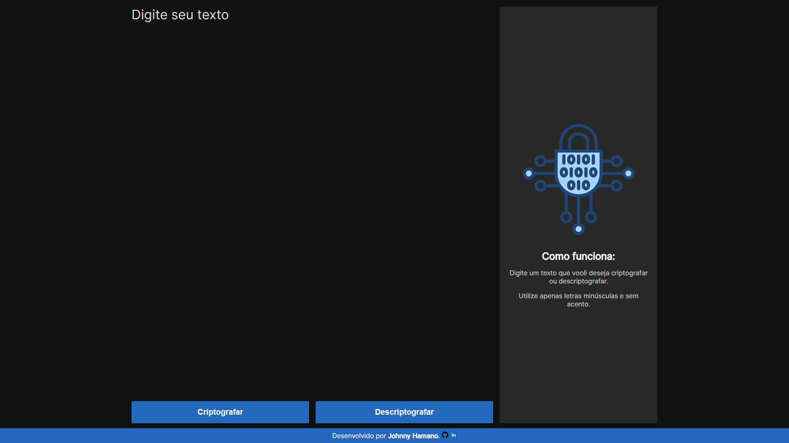

# Decodificador de textos

Desafio do ONE (Oracle Next Education).

Um programa para criptografar/codificar e descriptografar/decodificar textos.

As "chaves" de criptografia segundo as regras do projeto são:
- A letra "e" é convertida para "enter"
- A letra "i" é convertida para "imes"
- A letra "a" é convertida para "ai"
- A letra "o" é convertida para "ober"
- A letra "u" é convertida para "ufat"

Requisitos:
- Deve funcionar apenas com letras minúsculas.
- Não devem ser utilizados letras com acentos nem caracteres especiais.
- Deve ser possível converter uma palavra para a versão criptografada e também retornar uma palavra criptografada para a versão original.
- A página deve ter campos para inserção do texto a ser criptografado ou descriptografado, e a pessoa usuária deve poder escolher entre as duas opções.
- O resultado deve ser exibido na tela.

Extra: 
Um botão que copie o texto criptografado/descriptografado para a área de transferência - ou seja, que tenha a mesma funcionalidade do ctrl+C ou da opção "copiar" do menu dos aplicativos.

### Recursos externos
- [Figma do desafio](https://www.figma.com/design/tvFEYhVfZTjdJ5P24RGV21/Alura-Challenge---Desafio-1---L%C3%B3gica?node-id=0-1)
- [Trello do desafio](https://trello.com/b/qmLsVkkq/decodificador-de-texto-alura-challenges-oracle-one)

## HTML

### `#encryptor-output__default` 
Mensagem inicial mostrada ao abrir a página, explica o funcionamento do site. 
Este elemento é escondido ao se abrir o teclado virtual em um dispositivo móvel, voltando a ficar visível novamente ao se fechar o teclado virtual.

### `#btn-criptografar` e `#btn-descriptografar`
Quando acionados, criptografa ou descriptografa o conteúdo de texto inserido no elemento `#encryptor-input__textarea`. 
Exibe respostas diferentes após a validação do conteúdo.

- `#encryptor-output__text` 
Exibe o novo texto gerado pelo programa. 
Tem um título `h2` especificando "***Mensagem criptografada***" ou "***Mensagem descriptografada***" dependendo da função executada. 
Possui um botão `#btn-copiar` para copiar o conteúdo do novo texto para a área de transferência.

- `#encryptor-output__empty` 
Exibe uma mensagem alertando o usuário de que nenhum texto foi encontrado para ser criptografado ou descriptografado.

- `#encryptor-output__error` 
Exibe uma mensagem de erro caso identifique caractéres não permitidos. 
Notifica o usuário das regras do programa.

Quando acessado em um dispositivo móvel em modo retrato, a tela de resposta é aberta ocupando a tela inteira de maneira responsiva, com um botão de fechar no canto superior direito.

### `#btn-copiar`
Copia o novo texto gerado para a área de transferência. 
Exibe uma mensagem por notificação toast ao copiar um texto.

## CSS
Desenvolvido utilizando a recente tecnologia de CSS nesting (Aninhamento). 
Animações CSS utilizando as técnicas `@keyframe` e `transition`. 
Responsividade para diferentes resoluções e compatibilidade com modo retrato para dispositivos móveis. 

## JavaScript

### `function encrypt(text)`
Criptografa/codifica o texto e o exibe no elemento `#encryptor-output__text__content`.
Modifica o conteúdo do

### `function decrypt(text)`
Descriptografa/decodifica o texto e o exibe no elemento `#encryptor-output__text__content`.

### `function validate(text)`
Valida o texto inserido pelo usuário. 
Verifica se o campo de texto está vazio, e exibe uma mensagem no elemento `#encryptor-output__empty` alertando o usuário de que nenhum texto foi encontrado para ser criptografado ou descriptografado. 
Caso haja um texto, a função verifica se o mesmo respeita as regras do projeto, exibindo uma mensagem de erro no elemento `#encryptor-output__error` caso haja algum caractére não permitido: "Utilize apenas letras minúsculas e sem acento."

### `function display_toast(message, duration)`
Exibe uma notificação toast `#toast` com a dada mensagem `message`. 
A mensagem ficará na tela por um tempo de duração `duration` determinado dado em milisegundos.